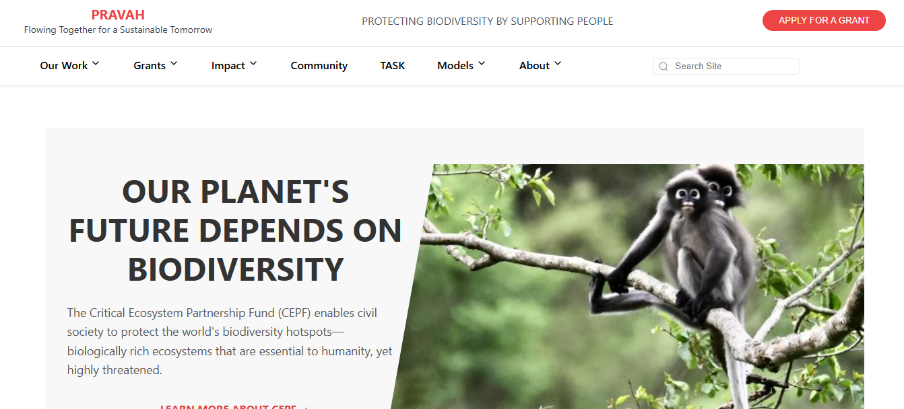
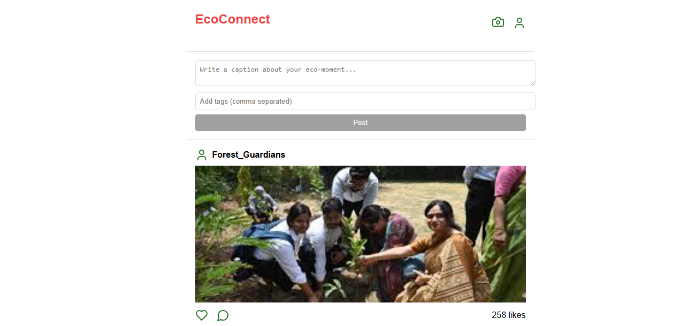
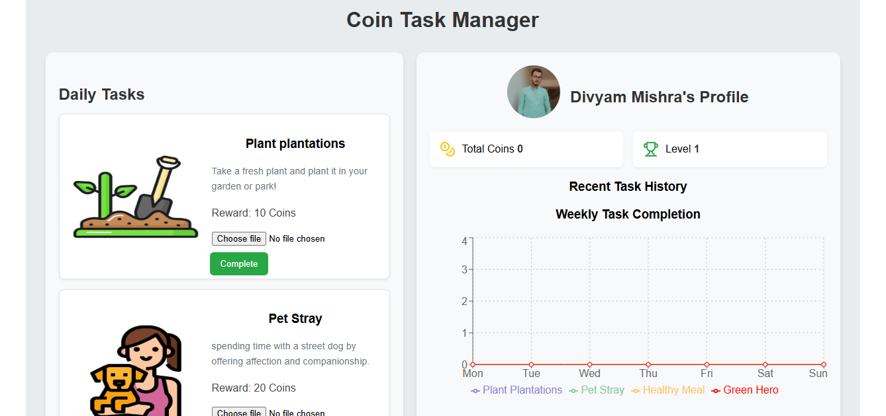
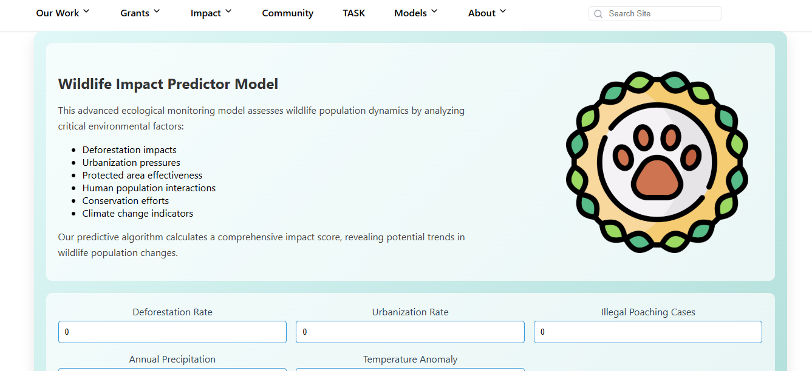

# 🌱 PRAVAH – Flowing Together for a Sustainable Tomorrow


PRAVAH is an **AI-powered biodiversity conservation platform** that blends technology with human participation to predict biodiversity loss, engage communities, and guide ecological action. From real-time tracking to community engagement, PRAVAH is redefining how we protect ecosystems.

🔗 **Live Website**: [https://imagine-cup-ashen.vercel.app](https://imagine-cup-ashen.vercel.app)  
📂 **GitHub Repo**: [Divyam-Mishra/Pravah](https://github.com/Divyam-Mishra/Pravah)

---

## 📌 Table of Contents

- [🌍 Motivation](#-motivation)
- [🚀 Features](#-features)
- [🧠 AI & Models](#-ai--models)
- [👥 Eco-Connect](#-eco-connect-community)
- [🛠️ Tech Stack](#-tech-stack)
- [📷 Screenshots](#-screenshots)
- [⚙️ Installation](#-installation)
- [📈 Impact](#-impact)
- [🤝 Contributing](#-contributing)
- [📄 License](#-license)

---

## 🌍 Motivation

Conservation efforts today are mostly **reactive**, not proactive. Our motivation lies in building a platform that:
- Predicts biodiversity loss before it happens.
- Engages students, researchers, and citizens in ecosystem action.
- Reduces carbon emissions through ecological awareness and decision-making.

---

## 🚀 Features

- 🧠 **Wildlife Impact Prediction Model**
- 📊 **Species Trend Forecasting**
- 🌍 **Biodiversity Hotspot Detection**
- 🔁 **Eco-Connect Community Feed**
- 📆 **Academic Task Manager with Rewards**
- 🧾 **AI Verification (Face, Timestamp, Object Detection)**

---

## 🧠 AI & Models

### 🐾 Wildlife Impact Predictor
- Factors: Deforestation, Urbanization, Climate Change, Conservation efforts
- Output: Population change trends based on input metrics

### 🌊 Aquatic Monitoring System
- Input: Turbidity, pH, temperature, salinity, DO
- Output: Water health status and ecosystem risk

---

## 👥 Eco-Connect Community

A social-media-like feed where users:
- 📸 Upload eco-friendly actions (tree plantation, animal rescue, etc.)
- 🪙 Earn Eco-Coins + academic rewards
- 🏆 Climb the leaderboard
- 👍 Vote, 🛑 Report inappropriate posts

**Verification Features**:
- 📅 Time-Stamped Tasks
- 🤳 Face Matching from Profile
- 🧠 Object Detection
- 🔍 Reverse Image Search

---

## 🛠️ Tech Stack

| Layer         | Technology                            |
|---------------|----------------------------------------|
| Frontend      | React.js, Vite, Tailwind CSS           |
| Backend       | Flask (AI), Node.js (API), Express     |
| Database      | PostgreSQL                             |
| AI/ML         | Python, PyTorch, HuggingFace, Vision API |
| Cloud & Infra | Vercel (Frontend), GitHub Pages        |

---

## 📷 Screenshots

| Home Page                          | EcoConnect UI                        |
|-----------------------------------|-------------------------------------|
|      |  |

| Task Manager                      | Wildlife Model                     |
|----------------------------------|------------------------------------|
|     |  |

---

## ⚙️ Installation

### 🔧 Requirements:
- Python ≥ 3.8  
- Node.js ≥ 18  
- PostgreSQL installed locally

### 🧱 Setup Steps

```bash
# Clone the repository
git clone https://github.com/Divyam-Mishra/Pravah.git
cd Pravah

# Frontend Setup
cd frontend
npm install
npm run dev

# Backend Setup
cd ../backend
pip install -r requirements.txt
python app.py
